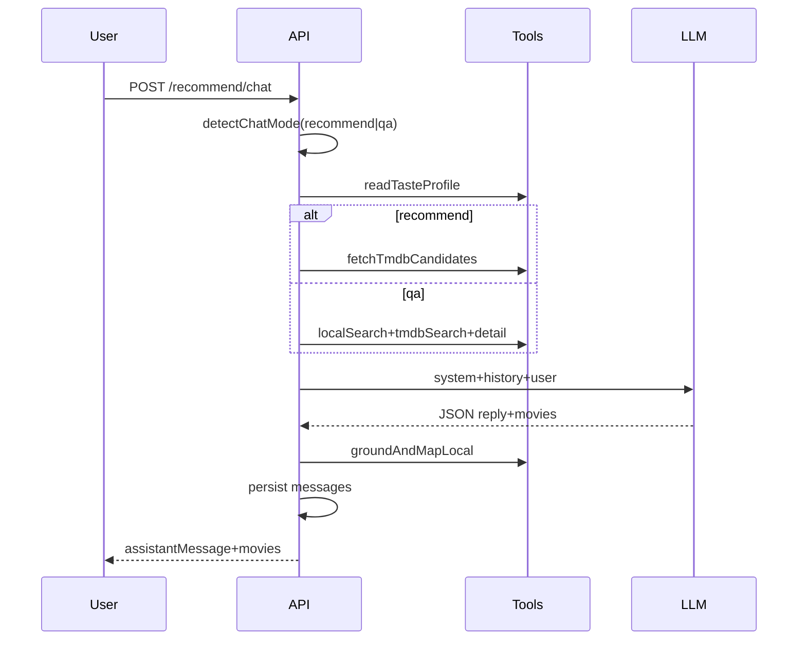

# AI 电影推荐

- 状态：已实现（受控半 Agent + 多轮会话 v1）
- 负责人：MovieMate 维护者
- 最后核对日期：2026-08-06

## 1. 目标

- **左栏**：根据收藏与观后笔记生成画像，展示本地「猜你喜欢」列表（无需先输入 prompt）。
- **右栏**：登录用户多轮对话推荐；会话可新建、切换、删除，消息持久化。
- 推荐结果仍受 TMDB 候选池约束（grounding），并映射 `local_movie_id` 以支持站内闭环。

## 2. 不做什么

- 不是全自治 Agent（无任意工具/任意 SQL）；
- 不推荐候选池外片名；
- 未登录不可用会话 API（画像推荐仍可匿名访问本地规则列表）。

## 3. 用户流程

1. 进入 `/ai-recommend`，左栏自动加载 `profile-feed`；
2. 登录后右栏选择或新建会话，多轮描述偏好；
3. 登录后右栏选择或新建会话，多轮描述偏好；
4. 对话返回自然语言 + 结构化电影列表；左栏可展示最近一次对话推荐；
5. 未登录从 AI 页跳转登录时携带 `state.from`，登录成功后回到 `/ai-recommend`（或原路径）；
6. 发送消息时输入框**立即清空**；若本轮请求失败则**回填**原文；
7. 切换历史会话时聊天区**不自动滚到底**，仅在当前用户发送并完成本轮回复后滚到最新；
8. 手动「新会话」标题默认为「新会话」，**首条消息成功后**自动改为首问截断标题。

## 4. 前后端契约

| 场景 | Method + Path | 鉴权 | 说明 |
| --- | --- | --- | --- |
| 单轮推荐（兼容） | `POST /api/recommend` | 可选 Bearer | `{ prompt }` |
| 画像推荐 | `GET /api/recommend/profile-feed` | 可选 Bearer | `{ movies[], tasteProfile? }` |
| 会话列表 | `GET /api/recommend/sessions` | Bearer | |
| 新建会话 | `POST /api/recommend/sessions` | Bearer | `{ title? }` |
| 删除会话 | `DELETE /api/recommend/sessions/:id` | Bearer | 204 |
| 会话消息 | `GET /api/recommend/sessions/:id/messages` | Bearer | |
| 多轮对话 | `POST /api/recommend/chat` | Bearer | `{ sessionId?, message }` |

`POST /api/recommend/chat` 成功示例：

```json
{
  "success": true,
  "sessionId": 3,
  "assistantMessage": "根据你的偏好…",
  "movies": [],
  "meta": {
    "mode": "recommend",
    "candidateCount": 30,
    "groundedCount": 4,
    "toolsUsed": ["tool_readTasteProfile", "tool_fetchTmdbCandidates", "tool_groundAndMapLocal"]
  }
}
```

`meta.mode`：`recommend`（候选池推荐，默认）或 `qa`（受控电影问答，`movies` 常为空）。问答模式仅使用站内 LIKE 检索 + TMDB 搜索/详情组装的资料块，**不是**全 Agent 开放式检索。

错误码与单轮一致：503（候选空）、422（校验失败）、400（参数）。

## 5. 受控半 Agent 流程



- 模型输出经 `chatResponse_schema`（Joi）校验，失败自动重试 1 次。
- 推荐模式：电影条目与候选池比对过滤；问答模式：回答须基于资料块，不展示模型推理链（前端仍为加载 Spin）。

## 6. 数据表

- `ai_recommend_sessions`、`ai_recommend_messages`（见 [server/sql/ai_chat_and_replies.sql](../../server/sql/ai_chat_and_replies.sql) 或 [init.sql](../../server/sql/init.sql)）。

## 7. 验收标准

- [ ] 左栏 profile-feed 有数据（至少本地高分兜底）；
- [ ] 登录后可新建/删除会话，消息可回看；
- [ ] 多轮对话第二句能引用上下文（同 session）；
- [ ] 候选/TMDB 异常时 503，池外结果 422；
- [ ] `npm run build -w moviemate-client` 通过。

## 8. 实现位置

- 核心：[`server/utils/recommendCore.js`](../../server/utils/recommendCore.js)
- 会话：[`server/utils/aiSessionStore.js`](../../server/utils/aiSessionStore.js)、[`server/router_handler/aiChat.js`](../../server/router_handler/aiChat.js)
- 路由：[`server/router/ai.js`](../../server/router/ai.js)
- 前端：[`client/src/components/AIRecommend.jsx`](../../client/src/components/AIRecommend.jsx)、[`client/src/store/API/vercelApi.jsx`](../../client/src/store/API/vercelApi.jsx)
