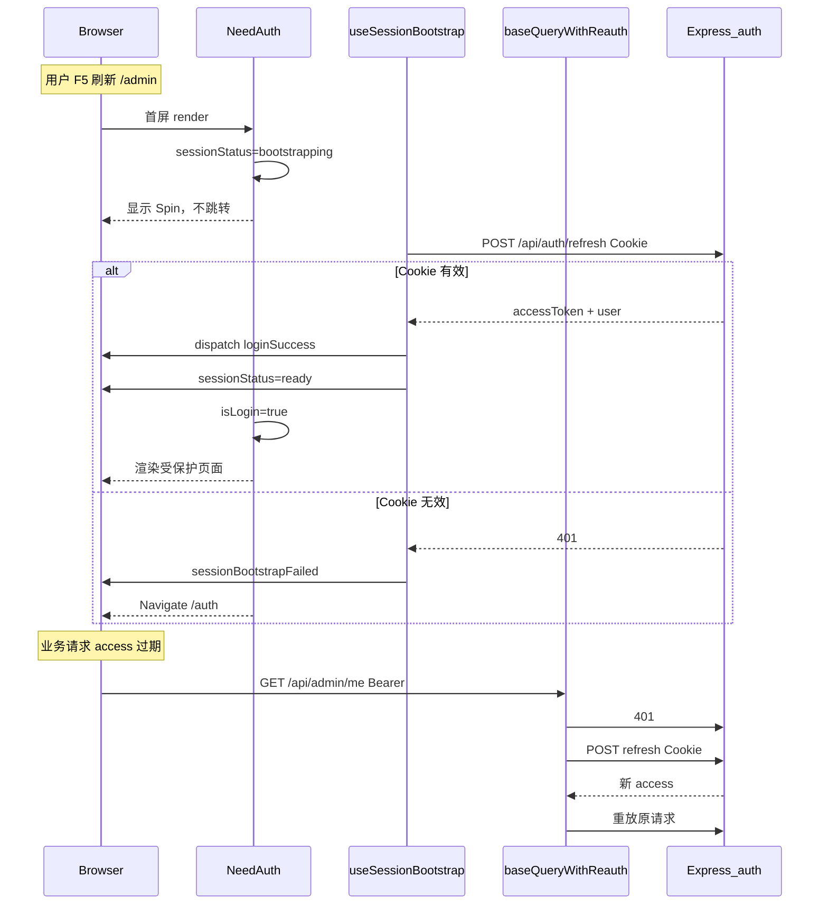
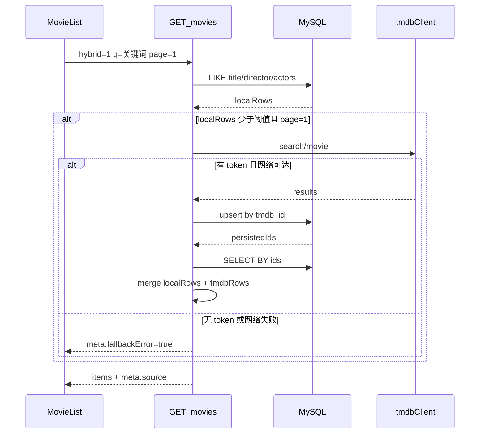
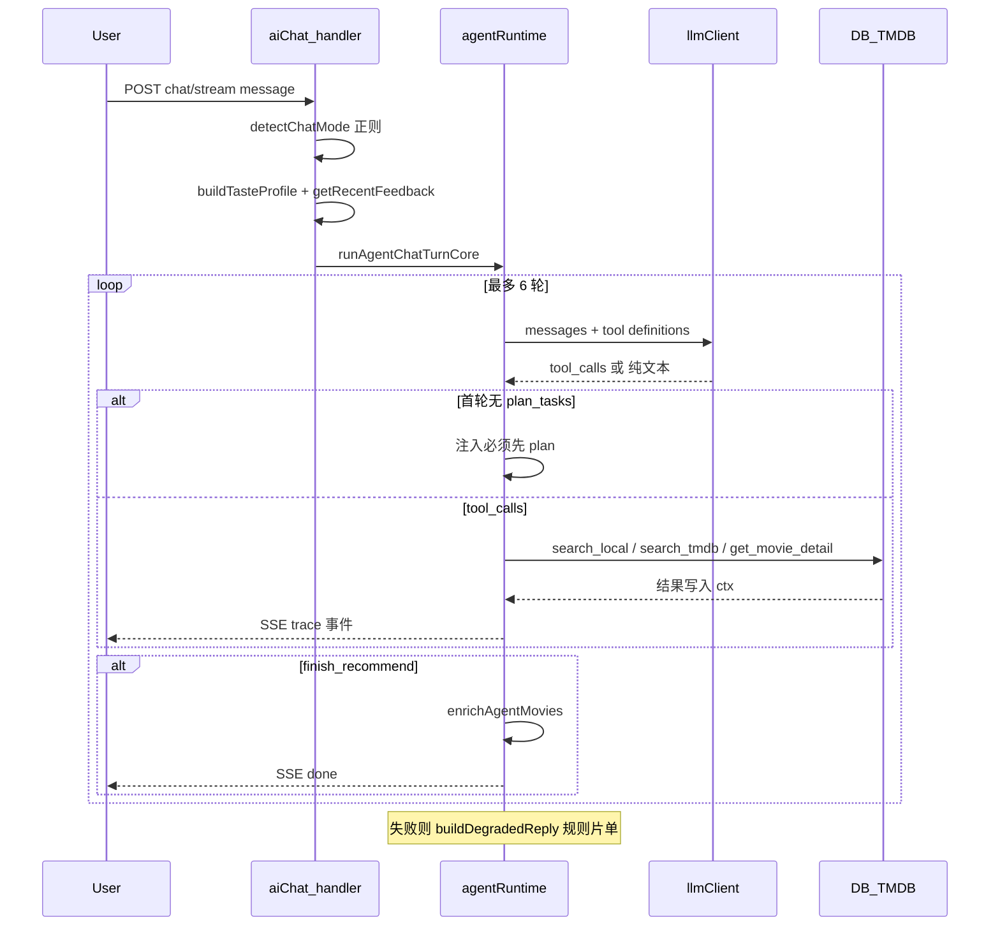

# P0 必懂实现 Walkthrough

> 目标：每条简历 bullet 都能从入口追到数据。对照源码自讲一遍，建议录音 5 分钟 × 3 段。

## 文件索引

| 主题 | 必读文件 |
| --- | --- |
| 双 Token | [`server/utils/authCookies.js`](../../server/utils/authCookies.js)、[`docs/features/auth-security.md`](../features/auth-security.md) |
| 401 重试 | [`client/src/store/API/baseQueryWithReauth.js`](../../client/src/store/API/baseQueryWithReauth.js) |
| F5 不跳登录 | [`client/src/store/Slice/authSlice.jsx`](../../client/src/store/Slice/authSlice.jsx)、[`client/src/hooks/useSessionBootstrap.jsx`](../../client/src/hooks/useSessionBootstrap.jsx)、[`client/src/components/NeedAuth.jsx`](../../client/src/components/NeedAuth.jsx) |
| 换号清缓存 | [`client/src/store/index.jsx`](../../client/src/store/index.jsx) |
| RBAC | [`server/utils/roles.js`](../../server/utils/roles.js)、[`server/middleware/adminMiddleware.js`](../../server/middleware/adminMiddleware.js)、[`server/router_handler/admin.js`](../../server/router_handler/admin.js) |
| Hybrid | [`server/router_handler/movie.js`](../../server/router_handler/movie.js)、[`server/utils/tmdbClient.js`](../../server/utils/tmdbClient.js) |
| Agent | [`server/utils/agentRuntime.js`](../../server/utils/agentRuntime.js)（约 630–890 行）、[`server/utils/recommendCore.js`](../../server/utils/recommendCore.js) `detectChatMode` |
| 反馈闭环 | [`server/utils/aiRecommendFeedback.js`](../../server/utils/aiRecommendFeedback.js)、[`docs/features/ai-recommendation-feedback.md`](../features/ai-recommendation-feedback.md) |

---

## 图 1：登录与 F5 刷新时序

**面试要点：**

- Refresh 为什么在 HttpOnly Cookie：JS 读不到，降低 XSS 偷 refresh 风险；path=`/api/auth` 缩小暴露面。
- `skipReauth`：refresh 请求本身不能再触发 refresh，防死循环。
- 换账号：`logout` 或 `loginSuccess` 且 user id 变化 → `resetApiState()` 清 adminApi 等。

---

## 图 2：Hybrid 搜索 + TMDB 回写

**面试要点：**

- 为何按 id 合并：TMDB 写回中文 title，用户搜英文时二次 LIKE 仍为空。
- 与离线 `sync:tmdb` 脚本分工：脚本 bulk 同步；Hybrid 是搜索时按需回写。
- 失败可观测：`missing_token` / `network_error` 前端 Alert。

---

## 图 3：Agent 一轮工具循环

**面试要点：**

- 意图分流是 **正则** `detectChatMode`，不是 LLM 分类；默认 recommend。
- 防幻觉：白名单工具 + 必须 grounding；reason 仍可能由 LLM 自由发挥。
- SSE：工具阶段非流式；最终回复单独 `stream: true` 出 token。
- 反馈：最近 👎 注入 system prompt，下轮避开不喜欢的片。

---

## 自测清单（讲完即过关）

- [ ] 能白板画出 Cookie refresh 与 NeedAuth 的关系
- [ ] 能解释 operator 为何不能封 moderator（权限矩阵）
- [ ] 能说出 Hybrid 触发条件（page=1、local < min(5, pageSize)）
- [ ] 能区分 recommend / qa / chat 三种 mode 的用户话术
- [ ] 能诚实说明「和 ChatGPT 推荐差在哪」（无向量、无长期记忆、候选池小）
